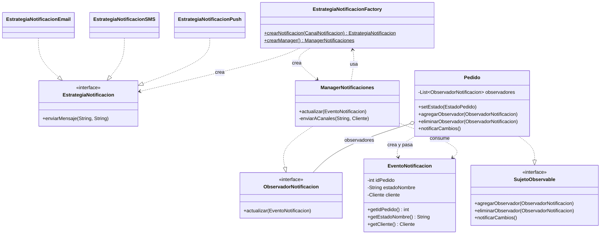

# Módulo de Notificaciones

## Resumen

El módulo `emarket.notificacion` implementa tres patrones de diseño que trabajan en conjunto:
**Observer** para detectar cambios de estado en los pedidos, **Strategy** para elegir el canal
de envío (Email, SMS, Push), y **Simple Factory** para centralizar la creación de objetos del
módulo sin exponer clases concretas al código cliente.

---

## Patrones y clases clave

### 1. Observer

| Rol | Clase / Interface |
|---|---|
| Contrato del sujeto | `SujetoObservable` |
| Contrato del observador | `ObservadorNotificacion` |
| Sujeto concreto | `Pedido` |
| Observador concreto | `ManagerNotificaciones` |
| Datos del evento | `EventoNotificacion` (DTO) |

`Pedido` mantiene una lista de observadores. Cada vez que cambia de estado
(`setEstado()`), llama a `notificarCambios()`, que construye un `EventoNotificacion`
con el id del pedido, el nombre del estado y el cliente, y lo entrega a cada observador
registrado. `ManagerNotificaciones` recibe ese evento sin necesitar una referencia al
`Pedido`, lo cual rompe la dependencia circular entre paquetes.

### 2. Strategy

| Rol | Clase / Interface |
|---|---|
| Contrato de estrategia | `EstrategiaNotificacion` |
| Canal EMAIL | `EstrategiaNotificacionEmail` |
| Canal SMS | `EstrategiaNotificacionSMS` |
| Canal PUSH | `EstrategiaNotificacionPush` |
| Selector de canal | `CanalNotificacion` (enum) |

Cada canal implementa `enviarMensaje(String mensaje, String destinatario)`.
`ManagerNotificaciones` itera los canales preferidos del cliente y delega el envío
a la estrategia correspondiente; no contiene ningún `if` o `switch` propio.

### 3. Simple Factory

| Rol | Clase |
|---|---|
| Fábrica | `EstrategiaNotificacionFactory` |

Dos métodos estáticos centralizan toda la instanciación:

- `crearNotificacion(CanalNotificacion)` → devuelve la estrategia correcta.
- `crearManager()` → devuelve un `ManagerNotificaciones` listo para registrarse.

Ningún cliente instancia clases concretas del módulo con `new`.

---

## Flujo de una notificación

```
PedidoService.confirmarCompra()
  │
  ├─ EstrategiaNotificacionFactory.crearManager()
  │    └─ new ManagerNotificaciones()          ← fábrica oculta el new
  │
  ├─ pedido.agregarObservador(manager)          ← registro dinámico (Observer)
  │
  └─ pedido.setEstado(new EstadoPendiente())
       │
       └─ Pedido.notificarCambios()
            │  crea EventoNotificacion(id, "PENDIENTE", cliente)
            │
            └─ ManagerNotificaciones.actualizar(evento)
                 │
                 └─ por cada CanalNotificacion en cliente.getCanalesPreferidos():
                      │
                      ├─ EstrategiaNotificacionFactory.crearNotificacion(canal)  ← fábrica (Strategy)
                      │    └─ new EstrategiaNotificacionEmail()  /  SMS  /  Push
                      │
                      └─ estrategia.enviarMensaje(mensaje, destinatario)
```

---

## Diagrama de clases (Mermaid)



---

## Ejemplo mínimo de uso

```java
// 1. Crear un pedido (PedidoService lo hace internamente)
ManagerNotificaciones manager = EstrategiaNotificacionFactory.crearManager(); // Simple Factory
pedido.agregarObservador(manager);                                            // Observer: registro

// 2. El cliente quiere recibir por Email y Push
cliente.modificarPreferenciasNotificacion(List.of(EMAIL, PUSH));

// 3. Cambiar el estado dispara la notificación automáticamente
pedido.setEstado(new EstadoEnviado());
// → ManagerNotificaciones recibe EventoNotificacion
// → itera [EMAIL, PUSH]
// → EstrategiaNotificacionFactory.crearNotificacion(EMAIL) → EstrategiaNotificacionEmail  (Strategy)
// → EMAIL: "Tu pedido #1 cambió a estado: ENVIADO"
// → EstrategiaNotificacionFactory.crearNotificacion(PUSH)  → EstrategiaNotificacionPush   (Strategy)
// → PUSH:  "Tu pedido #1 cambió a estado: ENVIADO"

// 4. Desuscribir el observador si ya no se necesita
pedido.eliminarObservador(manager);                                           // Observer: baja dinámica
```
