# libreria-TPO-PDS

Sistema de e-commerce de librería implementado en Java, aplicando patrones de diseño
(Facade, Composite, Observer, State, Strategy, Factory, Singleton, Builder).

## Patrones de diseño implementados

| Patrón | Clases participantes |
|--------|----------------------|
| **Facade** | `LibreriaFacade` (punto de entrada único) |
| **Composite** | `ComponenteCatalogo` (interfaz), `Categoria` (nodo), `Producto` (hoja) |
| **Observer** | `SujetoObservable`, `Pedido` (sujeto), `ObservadorNotificacion`, `ManagerNotificaciones` (observador), `EventoNotificacion` (DTO de evento) |
| **State** | `EstadoPedido` (interfaz), `Pedido` (contexto), `EstadoPendiente/Pagado/Enviado/Entregado` |
| **Strategy (pagos)** | `MetodoPago` (interfaz), `TarjetaDeCredito`, `PayPal`, `MercadoPago`, `Transferencia`, `ProcesadorPagos` (contexto) |
| **Strategy (notificaciones)** | `EstrategiaNotificacion` (interfaz), `EstrategiaNotificacionEmail/SMS/Push` |
| **Singleton** | `ConfiguracionSistema` (tasa de IVA y parámetros del sistema) |
| **Builder** | `DatosPago.Builder` |
| **Factory** | `MetodoPagoFactory`, `EstrategiaNotificacionFactory` |

### Nota sobre el patrón Composite y subcategorías

`Categoria` implementa `ComponenteCatalogo` y puede contener cualquier `ComponenteCatalogo`
como hijo, lo que incluye otras `Categoria`. Esto permite anidar subcategorías
arbitrariamente:

```
Catálogo de Libros
├── Ficción
│   ├── Cien años de soledad  (Producto)
│   ├── El principito         (Producto)
│   └── Fantasía              ← subcategoría anidada (Categoria dentro de Categoria)
│       └── El Señor de los Anillos  (Producto)
├── Técnicos
│   ├── Clean Code            (Producto)
│   └── Design Patterns       (Producto)
└── Historia
    ├── Sapiens               (Producto)
    └── El arte de la guerra  (Producto)
```

`getPrecio()` y `getStock()` en `Categoria` devuelven valores **agregados** (suma recursiva
de todos los hijos). Ver Javadoc en `ComponenteCatalogo` y `Categoria` para la semántica
completa y la tensión LSP que esto genera en listas mixtas.

### Nota sobre validación de stock en carrito

`CarritoService.modificarCantidad()` valida disponibilidad de stock vía
`CatalogoService.verificarDisponibilidad()` antes de modificar. `LibreriaFacade`
realiza la misma validación en su capa (defensa en profundidad).

### Nota sobre IVA

`PedidoService.confirmarCompra()` lee la tasa de impuestos exclusivamente desde
`ConfiguracionSistema.getInstance().getImpuestos()` (Singleton). No hay valores
de IVA hardcodeados en la lógica de negocio.

---

## UML

```mermaid
classDiagram

  class TipoPago {
    <<enumeration>>
    TARJETA_CREDITO
    PAYPAL
    MERCADO_PAGO
    TRANSFERENCIA
  }

  class CanalNotificacion {
    <<enumeration>>
    EMAIL
    SMS
    PUSH
  }

  class LibreriaFacade {
    -AutenticacionService autService
    -CatalogoService catService
    -CarritoService carritoService
    -PedidoService pedidoService
    -MetodoPagoFactory metodoPagoFactory
    +iniciarSesion(username: String, pass: String) boolean
    +cerrarSesion()
    +registrarClienteCompleto(username: String, pass: String, direccion: String, email: String, telefono: String, tokenDispositivo: String, canalesPreferidos: List~CanalNotificacion~) Cliente
    +registrarAdministrador(username: String, pass: String, claveAdmin: String)
    +buscarProducto(id: int) Producto
    +listarCatalogo() ComponenteCatalogo
    +agregarProductoAlCarrito(idProducto: int, cantidad: int)
    +eliminarProductoDelCarrito(idProducto: int)
    +modificarCantidadEnCarrito(idProducto: int, cantidad: int)
    +vaciarCarrito()
    +getItemsCarrito() List~ItemCarrito~
    +getTotalCarrito() double
    +pedirDatosPago(tipoPago: TipoPago, sc: Scanner) DatosPago
    +confirmarCompra(tipoPago: TipoPago, datosPago: DatosPago)
    +actualizarEstadoPedido(idPedido: int) Pedido
    +listarPedidosCliente() List~Pedido~
    +listarTodosLosPedidos() List~Pedido~
    +tomarNotificaciones() List~String~
    +estaAutenticado() boolean
    +esCliente() boolean
    +getUsernameActual() String
    +precargarDatos()
  }

  class AutenticacionService {
    -List~Usuario~ usuarios
    -Usuario usuarioActual
    -String CLAVE_ADMIN
    +iniciarSesion(username: String, pass: String) boolean
    +cerrarSesion()
    +registrarClienteCompleto(username: String, pass: String, direccion: String, email: String, telefono: String, tokenDispositivo: String, canales: List~CanalNotificacion~) Cliente
    +registrarAdministrador(username: String, pass: String, claveAdmin: String)
    +getClienteActual() Cliente
    +getUsuarioActual() Usuario
    +estaAutenticado() boolean
  }

  class CatalogoService {
    -ComponenteCatalogo catalogoRaiz
    +buscarProductoPorId(id: int) Producto
    +listarCatalogo() ComponenteCatalogo
    +verificarDisponibilidad(id: int, cantidad: int) boolean
    +agregarProducto(categoria: Categoria, producto: Producto)
    +crearCategoria(nombre: String, padre: Categoria) Categoria
    +setCatalogoRaiz(raiz: ComponenteCatalogo)
  }

  class CarritoService {
    -CatalogoService catService
    +agregarProducto(cliente: Cliente, idProducto: int, cantidad: int)
    +eliminarProducto(cliente: Cliente, producto: Producto)
    +modificarCantidad(cliente: Cliente, producto: Producto, cantidad: int)
    +vaciarCarrito(cliente: Cliente)
  }

  class PedidoService {
    -RepositorioPedidos repoPedidos
    -ProcesadorPagos procesadorPagos
    -ManagerNotificaciones managerNotificaciones
    +confirmarCompra(cliente: Cliente, tipoPago: TipoPago, datosPago: DatosPago) Pedido
    +actualizarEstadoPedido(idPedido: int) Pedido
    +listarPedidosPorCliente(cliente: Cliente) List~Pedido~
    +listarTodosLosPedidos() List~Pedido~
    -registrarObservadores(pedido: Pedido)
    -generarItemsPedido(carrito: Carrito) List~ItemPedido~
    -procesarReduccionStock(carrito: Carrito)
  }

  class ConfiguracionSistema {
    -static ConfiguracionSistema instancia
    -double impuestos
    -Map~String_String~ parametros
    -ConfiguracionSistema()
    +static getInstance() ConfiguracionSistema
    +getImpuestos() double
    +getParametro(clave: String) String
  }

  class RepositorioPedidos {
    -Map~Integer_Pedido~ pedidos
    -int proximoId
    +guardar(p: Pedido)
    +buscarPorId(id: int) Pedido
    +listarTodos() List~Pedido~
    +listarPorCliente(cliente: Cliente) List~Pedido~
    +getProximoId() int
  }

  class Usuario {
    <<abstract>>
    #String username
    #String passwordHash
    +getUsername() String
    +validarCredenciales(pass: String) boolean
  }

  class Cliente {
    -Carrito carrito
    -List~CanalNotificacion~ canalesPreferidos
    -List~Notificacion~ notificaciones
    -String direccion
    -String email
    -String telefono
    -String tokenDispositivo
    +getCarrito() Carrito
    +getCanalesPreferidos() List~CanalNotificacion~
    +modificarPreferenciasNotificacion(canales: List~CanalNotificacion~)
    +getDestinatarioPara(canal: CanalNotificacion) String
    +agregarNotificacion(mensaje: String)
    +tomarNotificaciones() List~String~
  }
  Usuario <|-- Cliente

  class Administrador {
    -String legajo
    +getLegajo() String
  }
  Usuario <|-- Administrador

  class ComponenteCatalogo {
    <<interface>>
    +getNombre() String
    +getPrecio() double
    +getStock() int
  }

  class Categoria {
    -String nombre
    -List~ComponenteCatalogo~ hijos
    +agregarComponente(c: ComponenteCatalogo)
    +eliminarComponente(c: ComponenteCatalogo)
    +getHijos() List~ComponenteCatalogo~
    +getNombre() String
    +getPrecio() double
    +getStock() int
  }
  ComponenteCatalogo <|.. Categoria
  Categoria "1" o-- "*" ComponenteCatalogo : contiene hijos
  Categoria --|> Categoria : puede anidarse como subcategoría

  class Producto {
    -int id
    -String nombre
    -double precio
    -int stock
    +getId() int
    +getNombre() String
    +getPrecio() double
    +getStock() int
    +verificarStock(cantidad: int) boolean
    +reducirStock(cantidad: int)
  }
  ComponenteCatalogo <|.. Producto

  class Carrito {
    -List~ItemCarrito~ items
    +agregarProducto(p: Producto, cantidad: int)
    +eliminarProducto(p: Producto)
    +modificarCantidad(p: Producto, cantidad: int)
    +calcularTotal() double
    +vaciarCarrito()
    +getItems() List~ItemCarrito~
    +estaVacio() boolean
  }

  class ItemCarrito {
    -Producto producto
    -int cantidad
    +getProducto() Producto
    +getCantidad() int
    +getSubtotal() double
    +modificarCantidad(cantidad: int)
  }

  class ItemPedido {
    -String nombreProducto
    -double precioUnitario
    -int cantidad
    +getNombreProducto() String
    +getPrecioUnitario() double
    +getCantidad() int
    +getSubtotal() double
  }

  class Notificacion {
    -String mensaje
    -LocalDateTime timestamp
    -boolean visto
    +getMensaje() String
    +isVisto() boolean
    +marcarVisto()
  }

  class SujetoObservable {
    <<interface>>
    +agregarObservador(o: ObservadorNotificacion)
    +eliminarObservador(o: ObservadorNotificacion)
    +notificarCambios()
  }

  class ObservadorNotificacion {
    <<interface>>
    +actualizar(evento: EventoNotificacion)
  }

  class EventoNotificacion {
    -int idPedido
    -String estadoNombre
    -Cliente cliente
    +getIdPedido() int
    +getEstadoNombre() String
    +getCliente() Cliente
  }

  class ManagerNotificaciones {
    +actualizar(evento: EventoNotificacion)
    -buildMensaje(evento: EventoNotificacion) String
    -enviarACanales(cliente: Cliente, mensaje: String)
  }
  ObservadorNotificacion <|.. ManagerNotificaciones

  class Pedido {
    -int id
    -EstadoPedido estadoActual
    -List~ObservadorNotificacion~ observadores
    -List~ItemPedido~ items
    -Cliente cliente
    -double total
    +setEstado(estado: EstadoPedido)
    +getEstado() EstadoPedido
    +avanzarEstado()
    +agregarObservador(o: ObservadorNotificacion)
    +eliminarObservador(o: ObservadorNotificacion)
    +notificarCambios()
    +getId() int
    +getCliente() Cliente
    +getTotal() double
    +getItems() List~ItemPedido~
  }
  SujetoObservable <|.. Pedido

  class EstadoPedido {
    <<interface>>
    +procesar(pedido: Pedido)
    +getNombre() String
  }

  class EstadoPendiente {
    +procesar(pedido: Pedido)
    +getNombre() String
  }

  class EstadoPagado {
    +procesar(pedido: Pedido)
    +getNombre() String
  }

  class EstadoEnviado {
    +procesar(pedido: Pedido)
    +getNombre() String
  }

  class EstadoEntregado {
    +procesar(pedido: Pedido)
    +getNombre() String
  }

  EstadoPedido <|.. EstadoPendiente
  EstadoPedido <|.. EstadoPagado
  EstadoPedido <|.. EstadoEnviado
  EstadoPedido <|.. EstadoEntregado

  class DatosPago {
    -String numeroTarjeta
    -String titular
    -String fechaExpiracion
    -String emailPayPal
    -String emailMercadoPago
    -String accessToken
    -String cbu
    -String banco
    +static paraTarjeta(numero: String, titular: String, fecha: String) DatosPago
    +static paraPayPal(email: String) DatosPago
    +static paraMercadoPago(email: String, accessToken: String) DatosPago
    +static paraTransferencia(cbu: String, banco: String) DatosPago
  }

  class ProcesadorPagos {
    -MetodoPagoFactory metodoPagoFactory
    +procesarCobro(pedido: Pedido, tipo: TipoPago, datos: DatosPago) boolean
  }

  class MetodoPagoFactory {
    +pedirDatos(tipo: TipoPago, sc: Scanner) DatosPago
    +crearMetodoPago(tipo: TipoPago, datos: DatosPago) MetodoPago
  }

  class MetodoPago {
    <<interface>>
    +pagar(monto: double) boolean
  }

  class TarjetaDeCredito {
    -String numero
    -String titular
    -String fechaExpiracion
    +pagar(monto: double) boolean
    +validar() boolean
    +static pedirDatos(sc: Scanner) DatosPago
  }

  class PayPal {
    -String email
    +pagar(monto: double) boolean
    +validar() boolean
    +static pedirDatos(sc: Scanner) DatosPago
  }

  class MercadoPago {
    -String email
    -String accessToken
    +pagar(monto: double) boolean
    +validar() boolean
    +static pedirDatos(sc: Scanner) DatosPago
  }

  class Transferencia {
    -String cbu
    -String banco
    +pagar(monto: double) boolean
    +validar() boolean
    +static pedirDatos(sc: Scanner) DatosPago
  }

  MetodoPago <|.. TarjetaDeCredito
  MetodoPago <|.. PayPal
  MetodoPago <|.. MercadoPago
  MetodoPago <|.. Transferencia

  class EstrategiaNotificacionFactory {
    +crearNotificacion(tipo: CanalNotificacion) EstrategiaNotificacion
    +static crearManager() ManagerNotificaciones
  }

  class EstrategiaNotificacion {
    <<interface>>
    +enviarMensaje(mensaje: String, destinatario: String)
  }

  class EstrategiaNotificacionEmail {
    -String smtpHost
    +enviarMensaje(mensaje: String, destinatario: String)
  }

  class EstrategiaNotificacionSMS {
    -String proveedorSMS
    +enviarMensaje(mensaje: String, destinatario: String)
  }

  class EstrategiaNotificacionPush {
    +enviarMensaje(mensaje: String, destinatario: String)
  }

  EstrategiaNotificacion <|.. EstrategiaNotificacionEmail
  EstrategiaNotificacion <|.. EstrategiaNotificacionSMS
  EstrategiaNotificacion <|.. EstrategiaNotificacionPush

  LibreriaFacade --> "1" AutenticacionService : delega auth a
  LibreriaFacade --> "1" CatalogoService : delega catálogo a
  LibreriaFacade --> "1" CarritoService : delega carrito a
  LibreriaFacade --> "1" PedidoService : delega pedidos a
  LibreriaFacade --> "1" MetodoPagoFactory : usa para pago

  AutenticacionService --> "*" Usuario : gestiona
  CatalogoService --> "1" ComponenteCatalogo : navega
  CarritoService --> "1" CatalogoService : valida stock en

  PedidoService --> "1" RepositorioPedidos : persiste en
  PedidoService --> "1" ProcesadorPagos : delega cobro a
  PedidoService --> "1" ManagerNotificaciones : registra como observador
  PedidoService ..> ConfiguracionSistema : consulta impuestos (Singleton)
  PedidoService ..> Carrito : lee y reduce stock de

  Cliente "1" --> "1" Carrito : tiene
  Cliente "1" *-- "*" Notificacion : almacena
  Carrito "1" *-- "*" ItemCarrito : contiene
  ItemCarrito "*" --> "1" Producto : referencia a
  RepositorioPedidos "1" o-- "*" Pedido : almacena
  Pedido "1" --> "1" EstadoPedido : gestiona estado con
  Pedido "1" --> "1" Cliente : pertenece a
  Pedido "1" *-- "*" ItemPedido : contiene snapshot de
  Pedido "1" o-- "*" ObservadorNotificacion : notifica a
  Pedido ..> EventoNotificacion : crea al notificar
  ProcesadorPagos ..> MetodoPagoFactory : usa para crear método
  ProcesadorPagos ..> Pedido : opera sobre
  MetodoPagoFactory ..> MetodoPago : crea
  MetodoPagoFactory ..> DatosPago : produce y consume
  ManagerNotificaciones --> "1" EstrategiaNotificacionFactory : utiliza
  ManagerNotificaciones ..> EstrategiaNotificacion : ejecuta
  EstrategiaNotificacionFactory ..> EstrategiaNotificacion : crea
```


