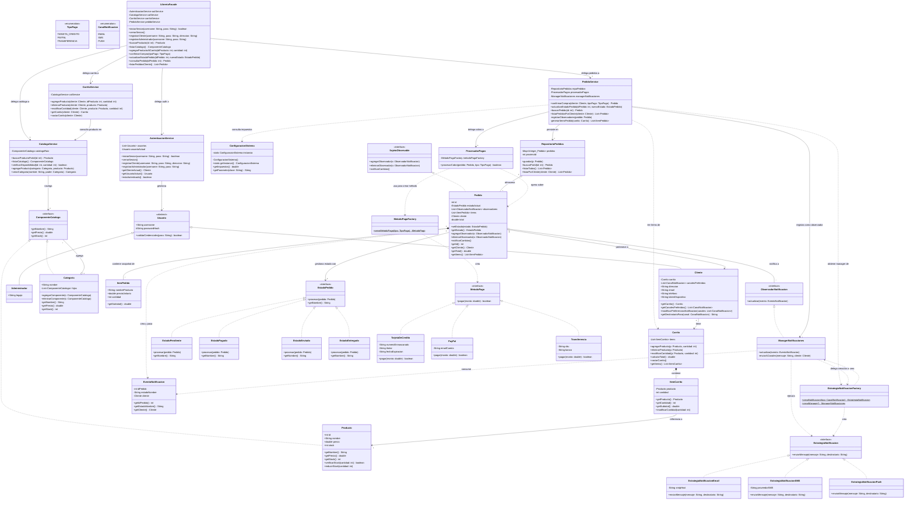

# libreria-TPO-PDS
## UML

```mermaid
classDiagram

  class TipoPago {
    <<enumeration>>
    TARJETA_CREDITO
    PAYPAL
    TRANSFERENCIA
  }

  class CanalNotificacion {
    <<enumeration>>
    EMAIL
    SMS
    PUSH
  }

  class LibreriaFacade {
    -AutenticacionService autService
    -CatalogoService catService
    -CarritoService carritoService
    -PedidoService pedidoService
    +iniciarSesion(username: String, pass: String) boolean
    +cerrarSesion()
    +registrarCliente(username: String, pass: String, direccion: String)
    +registrarAdministrador(username: String, pass: String)
    +buscarProducto(id: int) Producto
    +listarCatalogo() ComponenteCatalogo
    +agregarProductoAlCarrito(idProducto: int, cantidad: int)
    +confirmarCompra(tipoPago: TipoPago)
    +actualizarEstadoPedido(idPedido: int, nuevoEstado: EstadoPedido)
    +consultarPedido(idPedido: int) Pedido
    +listarPedidosCliente() List~Pedido~
  }

  class AutenticacionService {
    -List~Usuario~ usuarios
    -Usuario usuarioActual
    +iniciarSesion(username: String, pass: String) boolean
    +cerrarSesion()
    +registrarCliente(username: String, pass: String, direccion: String)
    +registrarAdministrador(username: String, pass: String)
    +getClienteActual() Cliente
    +getUsuarioActual() Usuario
    +estaAutenticado() boolean
  }

  class CatalogoService {
    -ComponenteCatalogo catalogoRaiz
    +buscarProductoPorId(id: int) Producto
    +listarCatalogo() ComponenteCatalogo
    +verificarDisponibilidad(id: int, cantidad: int) boolean
    +agregarProducto(categoria: Categoria, producto: Producto)
    +crearCategoria(nombre: String, padre: Categoria) Categoria
  }

  class CarritoService {
    -CatalogoService catService
    +agregarProducto(cliente: Cliente, idProducto: int, cantidad: int)
    +eliminarProducto(cliente: Cliente, producto: Producto)
    +modificarCantidad(cliente: Cliente, producto: Producto, cantidad: int)
    +getCarrito(cliente: Cliente) Carrito
    +vaciarCarrito(cliente: Cliente)
  }

  class PedidoService {
    -RepositorioPedidos repoPedidos
    -ProcesadorPagos procesadorPagos
    -ManagerNotificaciones managerNotificaciones
    +confirmarCompra(cliente: Cliente, tipoPago: TipoPago) Pedido
    +actualizarEstadoPedido(idPedido: int, nuevoEstado: EstadoPedido)
    +buscarPedido(id: int) Pedido
    +listarPedidosPorCliente(cliente: Cliente) List~Pedido~
    -registrarObservadores(pedido: Pedido)
    -generarItemsPedido(carrito: Carrito) List~ItemPedido~
  }

  class ConfiguracionSistema {
    -static ConfiguracionSistema instancia
    -ConfiguracionSistema()
    +static getInstance() ConfiguracionSistema
    +getImpuestos() double
    +getParametro(clave: String) String
  }

  class RepositorioPedidos {
    -Map~Integer_Pedido~ pedidos
    -int proximoId
    +guardar(p: Pedido)
    +buscarPorId(id: int) Pedido
    +listarTodos() List~Pedido~
    +listarPorCliente(cliente: Cliente) List~Pedido~
  }

  class Usuario {
    <<abstract>>
    +String username
    #String passwordHash
    +validarCredenciales(pass: String) boolean
  }

  class Cliente {
    -Carrito carrito
    -List~CanalNotificacion~ canalesPreferidos
    +String direccion
    +String email
    +String telefono
    +String tokenDispositivo
    +getCarrito() Carrito
    +getCanalesPreferidos() List~CanalNotificacion~
    +modificarPreferenciasNotificacion(canales: List~CanalNotificacion~)
    +getDestinatarioPara(canal: CanalNotificacion) String
  }
  Usuario <|-- Cliente

  class Administrador {
    +String legajo
  }
  Usuario <|-- Administrador

  class ComponenteCatalogo {
    <<interface>>
    +getNombre() String
    +getPrecio() double
    +getStock() int
  }

  class Categoria {
    +String nombre
    -List~ComponenteCatalogo~ hijos
    +agregarComponente(c: ComponenteCatalogo)
    +eliminarComponente(c: ComponenteCatalogo)
    +getNombre() String
    +getPrecio() double
    +getStock() int
  }
  ComponenteCatalogo <|.. Categoria

  class Producto {
    +int id
    +String nombre
    +double precio
    +int stock
    +getNombre() String
    +getPrecio() double
    +getStock() int
    +verificarStock(cantidad: int) boolean
    +reducirStock(cantidad: int)
  }
  ComponenteCatalogo <|.. Producto

  class Carrito {
    -List~ItemCarrito~ items
    +agregarProducto(p: Producto, cantidad: int)
    +eliminarProducto(p: Producto)
    +modificarCantidad(p: Producto, cantidad: int)
    +calcularTotal() double
    +vaciarCarrito()
    +getItems() List~ItemCarrito~
  }

  class ItemCarrito {
    -Producto producto
    -int cantidad
    +getProducto() Producto
    +getCantidad() int
    +getSubtotal() double
    +modificarCantidad(cantidad: int)
  }

  class ItemPedido {
    +String nombreProducto
    +double precioUnitario
    +int cantidad
    +getSubtotal() double
  }

  class SujetoObservable {
    <<interface>>
    +agregarObservador(o: ObservadorNotificacion)
    +eliminarObservador(o: ObservadorNotificacion)
    +notificarCambios()
  }

  class ObservadorNotificacion {
    <<interface>>
    +actualizar(evento: EventoNotificacion)
  }

  class EventoNotificacion {
    -int idPedido
    -String estadoNombre
    -Cliente cliente
    +getIdPedido() int
    +getEstadoNombre() String
    +getCliente() Cliente
  }

  class ManagerNotificaciones {
    +actualizar(evento: EventoNotificacion)
    -enviarACanales(mensaje: String, cliente: Cliente)
  }
  ObservadorNotificacion <|.. ManagerNotificaciones

  class Pedido {
    -int id
    -EstadoPedido estadoActual
    -List~ObservadorNotificacion~ observadores
    -List~ItemPedido~ items
    -Cliente cliente
    -double total
    +setEstado(estado: EstadoPedido)
    +getEstado() EstadoPedido
    +agregarObservador(o: ObservadorNotificacion)
    +eliminarObservador(o: ObservadorNotificacion)
    +notificarCambios()
    +getId() int
    +getCliente() Cliente
    +getTotal() double
    +getItems() List~ItemPedido~
  }
  SujetoObservable <|.. Pedido

  class EstadoPedido {
    <<interface>>
    +procesar(pedido: Pedido)
    +getNombre() String
  }

  class EstadoPendiente {
    +procesar(pedido: Pedido)
    +getNombre() String
  }

  class EstadoPagado {
    +procesar(pedido: Pedido)
    +getNombre() String
  }

  class EstadoEnviado {
    +procesar(pedido: Pedido)
    +getNombre() String
  }

  class EstadoEntregado {
    +procesar(pedido: Pedido)
    +getNombre() String
  }

  EstadoPedido <|.. EstadoPendiente
  EstadoPedido <|.. EstadoPagado
  EstadoPedido <|.. EstadoEnviado
  EstadoPedido <|.. EstadoEntregado

  class ProcesadorPagos {
    -MetodoPagoFactory metodoPagoFactory
    +procesarCobro(pedido: Pedido, tipo: TipoPago) boolean
  }

  class MetodoPagoFactory {
    +crearMetodoPago(tipo: TipoPago)$ MetodoPago
  }

  class MetodoPago {
    <<interface>>
    +pagar(monto: double) boolean
  }

  class TarjetaDeCredito {
    -String numeroEnmascarado
    -String titular
    -String fechaExpiracion
    +pagar(monto: double) boolean
  }

  class PayPal {
    -String emailCuenta
    +pagar(monto: double) boolean
  }

  class Transferencia {
    -String cbu
    -String banco
    +pagar(monto: double) boolean
  }

  MetodoPago <|.. TarjetaDeCredito
  MetodoPago <|.. PayPal
  MetodoPago <|.. Transferencia

  class EstrategiaNotificacionFactory {
    +crearNotificacion(tipo: CanalNotificacion)$ EstrategiaNotificacion
    +crearManager()$ ManagerNotificaciones
  }

  class EstrategiaNotificacion {
    <<interface>>
    +enviarMensaje(mensaje: String, destinatario: String)
  }

  class EstrategiaNotificacionEmail {
    -String smtpHost
    +enviarMensaje(mensaje: String, destinatario: String)
  }

  class EstrategiaNotificacionSMS {
    -String proveedorSMS
    +enviarMensaje(mensaje: String, destinatario: String)
  }

  class EstrategiaNotificacionPush {
    +enviarMensaje(mensaje: String, destinatario: String)
  }

  EstrategiaNotificacion <|.. EstrategiaNotificacionEmail
  EstrategiaNotificacion <|.. EstrategiaNotificacionSMS
  EstrategiaNotificacion <|.. EstrategiaNotificacionPush

  LibreriaFacade --> "1" AutenticacionService : delega auth a
  LibreriaFacade --> "1" CatalogoService : delega catálogo a
  LibreriaFacade --> "1" CarritoService : delega carrito a
  LibreriaFacade --> "1" PedidoService : delega pedidos a

  AutenticacionService --> "*" Usuario : gestiona
  CatalogoService --> "1" ComponenteCatalogo : navega
  CarritoService --> "1" CatalogoService : consulta producto en

  PedidoService --> "1" RepositorioPedidos : persiste en
  PedidoService --> "1" ProcesadorPagos : delega cobro a
  PedidoService --> "1" ManagerNotificaciones : registra como observador
  PedidoService ..> EstrategiaNotificacionFactory : obtiene manager de
  PedidoService ..> ConfiguracionSistema : consulta impuestos
  PedidoService ..> Carrito : lee ítems de

  Cliente "1" --> "1" Carrito : tiene
  Carrito "1" *-- "*" ItemCarrito : contiene
  ItemCarrito "*" --> "1" Producto : referencia a
  Categoria "1" o-- "*" ComponenteCatalogo : agrega
  RepositorioPedidos "1" o-- "*" Pedido : almacena
  Pedido "1" --> "1" EstadoPedido : gestiona estado con
  Pedido "1" --> "1" Cliente : pertenece a
  Pedido "1" *-- "*" ItemPedido : contiene snapshot de
  Pedido "1" o-- "*" ObservadorNotificacion : notifica a
  ProcesadorPagos ..> MetodoPagoFactory : usa para crear método
  ProcesadorPagos ..> Pedido : opera sobre
  MetodoPagoFactory ..> MetodoPago : crea
  Pedido ..> EventoNotificacion : crea y pasa
  ManagerNotificaciones ..> EventoNotificacion : consume
  ManagerNotificaciones ..> EstrategiaNotificacionFactory : delega creación a
  ManagerNotificaciones ..> EstrategiaNotificacion : ejecuta
  EstrategiaNotificacionFactory ..> EstrategiaNotificacion : crea
  EstrategiaNotificacionFactory ..> ManagerNotificaciones : crea
```
