# EMarket — Librería TPO PDS

Sistema de e-commerce de librería desarrollado en Java como trabajo práctico obligatorio.
Implementa un catálogo jerárquico de productos, carrito de compras, gestión de pedidos con
ciclo de vida completo y notificaciones multicanal, aplicando patrones de diseño GoF.

---

## Estructura de paquetes

```
emarket/
├── auth/           Usuario (abstracto), Cliente, Administrador, AutenticacionService
├── carrito/        Carrito, ItemCarrito, CarritoService
├── catalogo/       ComponenteCatalogo (interfaz), Categoria, Producto, CatalogoService
├── config/         ConfiguracionSistema (Singleton)
├── estado/         EstadoPedido (interfaz), EstadoPendiente, EstadoPagado, EstadoEnviado, EstadoEntregado
├── facade/         LibreriaFacade
├── notificacion/   CanalNotificacion, Notificacion, EventoNotificacion,
│                   SujetoObservable, ObservadorNotificacion, ManagerNotificaciones,
│                   EstrategiaNotificacion, EstrategiaNotificacionEmail/SMS/Push,
│                   EstrategiaNotificacionFactory
├── pago/           TipoPago, DatosPago, MetodoPago, TarjetaDeCredito, PayPal,
│                   MercadoPago, Transferencia, MetodoPagoFactory, ProcesadorPagos
├── pedido/         Pedido, ItemPedido, RepositorioPedidos, PedidoService
├── util/           Validaciones
└── Main.java       Punto de entrada — UI de consola
```

---

## Patrones de diseño

### Facade — `LibreriaFacade`

Punto de entrada único a todo el sistema. `Main.java` solo interactúa con esta clase;
los subsistemas (auth, catálogo, carrito, pedidos) quedan encapsulados detrás de ella.

```
Main → LibreriaFacade → AutenticacionService
                      → CatalogoService
                      → CarritoService
                      → PedidoService
```

---

### Composite — Catálogo jerárquico

Permite organizar productos en categorías y subcategorías con profundidad arbitraria.

| Rol | Clase |
|-----|-------|
| Component | `ComponenteCatalogo` (interfaz) |
| Composite | `Categoria` — contiene otros `ComponenteCatalogo` (productos u otras categorías) |
| Leaf | `Producto` — nodo hoja sin hijos |

`Categoria.getPrecio()` y `getStock()` devuelven la **suma recursiva** de todos los hijos
(valor agregado, no unitario). `Producto` devuelve valores unitarios.

Árbol de demo precargado:

```
Catálogo de Libros
├── Ficción
│   ├── Cien años de soledad   $2500  stock: 8
│   ├── El principito          $1800  stock: 12
│   └── Fantasía                ← subcategoría anidada dentro de Ficción
│       └── El Señor de los Anillos  $3800  stock: 5
├── Técnicos
│   ├── Clean Code             $4500  stock: 5
│   └── Design Patterns        $5000  stock: 3
└── Historia
    ├── Sapiens                $3200  stock: 10
    └── El arte de la guerra   $1500  stock: 15
```

---

### Strategy — Métodos de pago

Permite seleccionar el método de pago en tiempo de ejecución sin cambiar la lógica del
procesador.

| Rol | Clase |
|-----|-------|
| Strategy (interfaz) | `MetodoPago` — define `pagar(double monto): boolean` |
| Estrategias concretas | `TarjetaDeCredito`, `PayPal`, `MercadoPago`, `Transferencia` |
| Contexto | `ProcesadorPagos` — recibe la estrategia creada por `MetodoPagoFactory` y llama `pagar()` |
| Enum de selección | `TipoPago` — `TARJETA_CREDITO`, `PAYPAL`, `MERCADO_PAGO`, `TRANSFERENCIA` |

Flujo: el usuario elige un `TipoPago` → `MetodoPagoFactory` crea el `MetodoPago` concreto con
los `DatosPago` ingresados → `ProcesadorPagos.procesarCobro()` lo ejecuta polimórficamente.

---

### Strategy — Canales de notificación

Mismo patrón aplicado al envío de notificaciones.

| Rol | Clase |
|-----|-------|
| Strategy (interfaz) | `EstrategiaNotificacion` — define `enviarMensaje(mensaje, destinatario)` |
| Estrategias concretas | `EstrategiaNotificacionEmail`, `EstrategiaNotificacionSMS`, `EstrategiaNotificacionPush` |
| Contexto | `ManagerNotificaciones` — itera los canales preferidos del cliente y despacha |
| Factory | `EstrategiaNotificacionFactory` — crea la estrategia correcta según `CanalNotificacion` |

Cada cliente puede tener uno o más canales preferidos (`EMAIL`, `SMS`, `PUSH`). Al cambiar
el estado de un pedido, recibe la notificación por todos sus canales configurados.

---

### Observer — Notificaciones de cambio de estado

Desacopla el `Pedido` del mecanismo de notificación.

| Rol | Clase |
|-----|-------|
| Sujeto (interfaz) | `SujetoObservable` |
| Sujeto concreto | `Pedido` — llama `notificarCambios()` cada vez que su estado cambia |
| Observador (interfaz) | `ObservadorNotificacion` — define `actualizar(EventoNotificacion)` |
| Observador concreto | `ManagerNotificaciones` — reacciona al evento y envía notificaciones |
| DTO de evento | `EventoNotificacion` — transporta `idPedido`, `estadoNombre` y `Cliente` |

`EventoNotificacion` desacopla al observador de `Pedido`: `ObservadorNotificacion` no necesita
importar la clase `Pedido`.

---

### State — Ciclo de vida del pedido

El comportamiento del pedido cambia según su estado actual sin condicionales en el contexto.

| Rol | Clase |
|-----|-------|
| Estado (interfaz) | `EstadoPedido` — define `procesar(Pedido)` y `getNombre()` |
| Contexto | `Pedido` — delega `avanzarEstado()` al estado actual |
| Estados | `EstadoPendiente` → `EstadoPagado` → `EstadoEnviado` → `EstadoEntregado` |

Cada estado conoce su sucesor y lo asigna directamente sobre el contexto al procesar.
`EstadoEntregado.procesar()` lanza una excepción (estado terminal, sin sucesor).

Transición automática al confirmar compra: el pedido nace en `PENDIENTE` y avanza a
`PAGADO` una vez que el cobro es exitoso, disparando una notificación al cliente.

---

### Singleton — `ConfiguracionSistema`

Instancia única con parámetros globales del sistema. `PedidoService` la consulta para
obtener la tasa de IVA (21 %) en lugar de hardcodearla.

```java
double iva = ConfiguracionSistema.getInstance().getImpuestos(); // 0.21
```

---

### Builder — `DatosPago`

Construcción flexible de los datos de pago. Expone factory methods estáticos por tipo:

```java
DatosPago.paraTarjeta(numero, titular, fechaExpiracion)
DatosPago.paraPayPal(email)
DatosPago.paraMercadoPago(email, accessToken)
DatosPago.paraTransferencia(cbu, banco)
```

---

## Flujo completo: Confirmar compra

```
1. Cliente agrega productos al Carrito
      CarritoService verifica stock disponible antes de agregar (o modificar cantidad)

2. Cliente confirma compra con un método de pago
      PedidoService.confirmarCompra()
        ├── generarItemsPedido()     → snapshot inmutable de nombre/precio al momento de la compra
        ├── calcular total           → subtotal × (1 + ConfiguracionSistema.getImpuestos())
        ├── crear Pedido             → estado inicial PENDIENTE (sin observers aún)
        ├── procesarReduccionStock() → descuenta unidades del stock de cada producto
        ├── registrarObservadores()  → agrega ManagerNotificaciones al Pedido
        ├── ProcesadorPagos.procesarCobro()
        │     └── MetodoPagoFactory crea el MetodoPago concreto → llama pagar()
        └── pedido.avanzarEstado()
              └── EstadoPendiente.procesar() → setEstado(EstadoPagado)
                    └── Pedido.notificarCambios()
                          └── ManagerNotificaciones.actualizar(EventoNotificacion)
                                ├── cliente.agregarNotificacion(mensaje)
                                └── enviarACanales() → EstrategiaNotificacion por cada canal preferido

3. Pedido guardado en RepositorioPedidos, carrito vaciado
```

---

## Flujo: Cambio de estado por administrador

```
Admin → LibreriaFacade.actualizarEstadoPedido(id)
          └── PedidoService.actualizarEstadoPedido(id)
                └── pedido.avanzarEstado()
                      └── estadoActual.procesar(pedido) → asigna el estado siguiente
                            └── Pedido.setEstado() → notificarCambios() → Observer
```

---

## Validaciones implementadas

| Validación | Dónde |
|------------|-------|
| Stock suficiente al agregar al carrito | `CarritoService.agregarProducto()` |
| Stock suficiente al modificar cantidad | `CarritoService.modificarCantidad()` y `LibreriaFacade` |
| Carrito no vacío al confirmar compra | `PedidoService.confirmarCompra()` |
| Credenciales correctas al iniciar sesión | `AutenticacionService` + `Usuario.validarCredenciales()` |
| Clave secreta para registrar admin | `AutenticacionService.registrarAdministrador()` |
| Formato de tarjeta (16 dígitos), CBU (22 dígitos), email, fecha de expiración | `Validaciones` (util) |
| Solo clientes pueden comprar / solo admins pueden cambiar estados | `LibreriaFacade` |

---

## Principios SOLID aplicados

| Principio | Aplicación en el proyecto |
|-----------|--------------------------|
| **S — Single Responsibility** | Cada clase tiene una única razón de cambio: `CarritoService` gestiona el carrito, `AutenticacionService` gestiona usuarios, `PedidoService` orquesta pedidos. `confirmarCompra()` fue refactorizado con helpers privados (`generarItemsPedido`, `procesarReduccionStock`, `registrarObservadores`) para que cada fragmento tenga responsabilidad propia. |
| **O — Open/Closed** | El sistema está abierto a extensión y cerrado a modificación. Agregar un nuevo método de pago implica solo crear una clase que implemente `MetodoPago` y registrarla en `MetodoPagoFactory`, sin tocar `ProcesadorPagos` ni `PedidoService`. Lo mismo aplica a nuevos canales de notificación (`EstrategiaNotificacion`) y nuevos estados (`EstadoPedido`). |
| **L — Liskov Substitution** | Cualquier `MetodoPago`, `EstadoPedido` o `EstrategiaNotificacion` concreto puede reemplazarse por otro sin romper el código cliente. Se documenta la tensión LSP en `ComponenteCatalogo`: `Categoria.getPrecio()` devuelve un valor agregado mientras que `Producto.getPrecio()` devuelve un valor unitario; este comportamiento está explicitado en los Javadoc para que los clientes de la interfaz no lo asuman implícitamente. |
| **I — Interface Segregation** | Las interfaces son pequeñas y enfocadas: `MetodoPago` tiene solo `pagar()`, `EstadoPedido` solo `procesar()` y `getNombre()`, `ObservadorNotificacion` solo `actualizar()`, `EstrategiaNotificacion` solo `enviarMensaje()`. Ninguna clase implementadora está forzada a definir métodos que no usa. |
| **D — Dependency Inversion** | Los módulos de alto nivel dependen de abstracciones, no de implementaciones concretas. `ProcesadorPagos` depende de `MetodoPago` (interfaz), `Pedido` depende de `EstadoPedido` (interfaz), `PedidoService` depende de `ObservadorNotificacion` (interfaz). Las implementaciones concretas se inyectan vía factory o constructor. |

---

## Patrones GRASP aplicados

| Patrón | Aplicación en el proyecto |
|--------|--------------------------|
| **Information Expert** | Cada clase opera sobre los datos que posee: `Carrito` calcula su propio total, `Producto` verifica y reduce su propio stock, `Cliente` gestiona sus propias notificaciones y canales preferidos. |
| **Creator** | La responsabilidad de crear objetos recae en quien tiene la información necesaria: `PedidoService` crea `Pedido` e `ItemPedido` (tiene el carrito y el cliente), `Pedido` crea `EventoNotificacion` (tiene el estado y el cliente), `EstrategiaNotificacionFactory` crea las estrategias concretas. |
| **Controller** | `LibreriaFacade` actúa como controlador del sistema: recibe todas las operaciones de la UI, valida permisos por rol y delega a los servicios especializados. Centraliza el acceso sin contener lógica de negocio propia. |
| **Low Coupling** | Las dependencias fluyen a través de interfaces (`MetodoPago`, `EstadoPedido`, `ComponenteCatalogo`, `ObservadorNotificacion`). `EventoNotificacion` evita que `ObservadorNotificacion` dependa directamente de `Pedido`. Los servicios se comunican entre sí solo a través de `LibreriaFacade`. |
| **High Cohesion** | Cada clase agrupa responsabilidades fuertemente relacionadas. `AutenticacionService` solo maneja autenticación y registro, `CatalogoService` solo navega el árbol de productos, `RepositorioPedidos` solo persiste y consulta pedidos. |
| **Polymorphism** | El comportamiento variable está encapsulado en jerarquías polimórficas: método de cobro (`MetodoPago`), estado del pedido (`EstadoPedido`), canal de notificación (`EstrategiaNotificacion`), y nodo del catálogo (`ComponenteCatalogo`). Se evitan condicionales tipo `if (tipo == TARJETA)`. |
| **Pure Fabrication** | `RepositorioPedidos`, `CarritoService` y `ProcesadorPagos` no representan entidades del dominio real, sino clases de servicio creadas para lograr alta cohesión y bajo acoplamiento en operaciones que de otro modo recaerían en clases con demasiadas responsabilidades. |
| **Protected Variations** | Las interfaces protegen al sistema de los cambios: agregar un nuevo método de pago, un nuevo estado de pedido o un nuevo canal de notificación no impacta en el código existente. `ConfiguracionSistema` protege al resto del sistema de cambios en parámetros como la tasa de IVA. |

---

## Datos de demo (precargados al iniciar)

| Usuario | Contraseña | Rol | Canales de notificación |
|---------|-----------|-----|------------------------|
| `juan` | `juan1234` | Cliente | EMAIL, PUSH |
| `admin` | `admin123` | Administrador | — |

---

## UML

El diagrama de clases completo se encuentra en [`UML.V2.txt`](./UML.V2.txt) en formato
Mermaid. A continuación se incluye embebido:

```mermaid
classDiagram

  class TipoPago {
    <<enumeration>>
    TARJETA_CREDITO
    PAYPAL
    MERCADO_PAGO
    TRANSFERENCIA
  }

  class CanalNotificacion {
    <<enumeration>>
    EMAIL
    SMS
    PUSH
  }

  class LibreriaFacade {
    -AutenticacionService autService
    -CatalogoService catService
    -CarritoService carritoService
    -PedidoService pedidoService
    -MetodoPagoFactory metodoPagoFactory
    +iniciarSesion(username: String, pass: String) boolean
    +cerrarSesion()
    +registrarClienteCompleto(username: String, pass: String, direccion: String, email: String, telefono: String, tokenDispositivo: String, canalesPreferidos: List~CanalNotificacion~) Cliente
    +registrarAdministrador(username: String, pass: String, claveAdmin: String)
    +buscarProducto(id: int) Producto
    +listarCatalogo() ComponenteCatalogo
    +agregarProductoAlCarrito(idProducto: int, cantidad: int)
    +eliminarProductoDelCarrito(idProducto: int)
    +modificarCantidadEnCarrito(idProducto: int, cantidad: int)
    +vaciarCarrito()
    +getItemsCarrito() List~ItemCarrito~
    +getTotalCarrito() double
    +pedirDatosPago(tipoPago: TipoPago, sc: Scanner) DatosPago
    +confirmarCompra(tipoPago: TipoPago, datosPago: DatosPago)
    +actualizarEstadoPedido(idPedido: int) Pedido
    +listarPedidosCliente() List~Pedido~
    +listarTodosLosPedidos() List~Pedido~
    +tomarNotificaciones() List~String~
    +estaAutenticado() boolean
    +esCliente() boolean
    +getUsernameActual() String
    +precargarDatos()
  }

  class AutenticacionService {
    -List~Usuario~ usuarios
    -Usuario usuarioActual
    -String CLAVE_ADMIN
    +iniciarSesion(username: String, pass: String) boolean
    +cerrarSesion()
    +registrarClienteCompleto(username: String, pass: String, direccion: String, email: String, telefono: String, tokenDispositivo: String, canales: List~CanalNotificacion~) Cliente
    +registrarAdministrador(username: String, pass: String, claveAdmin: String)
    +getClienteActual() Cliente
    +getUsuarioActual() Usuario
    +estaAutenticado() boolean
  }

  class CatalogoService {
    -ComponenteCatalogo catalogoRaiz
    +buscarProductoPorId(id: int) Producto
    +listarCatalogo() ComponenteCatalogo
    +verificarDisponibilidad(id: int, cantidad: int) boolean
    +agregarProducto(categoria: Categoria, producto: Producto)
    +crearCategoria(nombre: String, padre: Categoria) Categoria
    +setCatalogoRaiz(raiz: ComponenteCatalogo)
  }

  class CarritoService {
    -CatalogoService catService
    +agregarProducto(cliente: Cliente, idProducto: int, cantidad: int)
    +eliminarProducto(cliente: Cliente, producto: Producto)
    +modificarCantidad(cliente: Cliente, producto: Producto, cantidad: int)
    +vaciarCarrito(cliente: Cliente)
  }

  class PedidoService {
    -RepositorioPedidos repoPedidos
    -ProcesadorPagos procesadorPagos
    -ManagerNotificaciones managerNotificaciones
    +confirmarCompra(cliente: Cliente, tipoPago: TipoPago, datosPago: DatosPago) Pedido
    +actualizarEstadoPedido(idPedido: int) Pedido
    +listarPedidosPorCliente(cliente: Cliente) List~Pedido~
    +listarTodosLosPedidos() List~Pedido~
    -registrarObservadores(pedido: Pedido)
    -generarItemsPedido(carrito: Carrito) List~ItemPedido~
    -procesarReduccionStock(carrito: Carrito)
  }

  class ConfiguracionSistema {
    -static ConfiguracionSistema instancia
    -double impuestos
    -Map~String_String~ parametros
    -ConfiguracionSistema()
    +static getInstance() ConfiguracionSistema
    +getImpuestos() double
    +getParametro(clave: String) String
  }

  class RepositorioPedidos {
    -Map~Integer_Pedido~ pedidos
    -int proximoId
    +guardar(p: Pedido)
    +buscarPorId(id: int) Pedido
    +listarTodos() List~Pedido~
    +listarPorCliente(cliente: Cliente) List~Pedido~
    +getProximoId() int
  }

  class Usuario {
    <<abstract>>
    #String username
    #String passwordHash
    +getUsername() String
    +validarCredenciales(pass: String) boolean
  }

  class Cliente {
    -Carrito carrito
    -List~CanalNotificacion~ canalesPreferidos
    -List~Notificacion~ notificaciones
    -String direccion
    -String email
    -String telefono
    -String tokenDispositivo
    +getCarrito() Carrito
    +getCanalesPreferidos() List~CanalNotificacion~
    +modificarPreferenciasNotificacion(canales: List~CanalNotificacion~)
    +getDestinatarioPara(canal: CanalNotificacion) String
    +agregarNotificacion(mensaje: String)
    +tomarNotificaciones() List~String~
  }
  Usuario <|-- Cliente

  class Administrador {
    -String legajo
    +getLegajo() String
  }
  Usuario <|-- Administrador

  class ComponenteCatalogo {
    <<interface>>
    +getNombre() String
    +getPrecio() double
    +getStock() int
  }

  class Categoria {
    -String nombre
    -List~ComponenteCatalogo~ hijos
    +agregarComponente(c: ComponenteCatalogo)
    +eliminarComponente(c: ComponenteCatalogo)
    +getHijos() List~ComponenteCatalogo~
    +getNombre() String
    +getPrecio() double
    +getStock() int
  }
  ComponenteCatalogo <|.. Categoria
  Categoria "1" o-- "*" ComponenteCatalogo : contiene hijos

  class Producto {
    -int id
    -String nombre
    -double precio
    -int stock
    +getId() int
    +getNombre() String
    +getPrecio() double
    +getStock() int
    +verificarStock(cantidad: int) boolean
    +reducirStock(cantidad: int)
  }
  ComponenteCatalogo <|.. Producto

  class Carrito {
    -List~ItemCarrito~ items
    +agregarProducto(p: Producto, cantidad: int)
    +eliminarProducto(p: Producto)
    +modificarCantidad(p: Producto, cantidad: int)
    +calcularTotal() double
    +vaciarCarrito()
    +getItems() List~ItemCarrito~
    +estaVacio() boolean
  }

  class ItemCarrito {
    -Producto producto
    -int cantidad
    +getProducto() Producto
    +getCantidad() int
    +getSubtotal() double
    +modificarCantidad(cantidad: int)
  }

  class ItemPedido {
    -String nombreProducto
    -double precioUnitario
    -int cantidad
    +getNombreProducto() String
    +getPrecioUnitario() double
    +getCantidad() int
    +getSubtotal() double
  }

  class Notificacion {
    -String mensaje
    -LocalDateTime timestamp
    -boolean visto
    +getMensaje() String
    +isVisto() boolean
    +marcarVisto()
  }

  class SujetoObservable {
    <<interface>>
    +agregarObservador(o: ObservadorNotificacion)
    +eliminarObservador(o: ObservadorNotificacion)
    +notificarCambios()
  }

  class ObservadorNotificacion {
    <<interface>>
    +actualizar(evento: EventoNotificacion)
  }

  class EventoNotificacion {
    -int idPedido
    -String estadoNombre
    -Cliente cliente
    +getIdPedido() int
    +getEstadoNombre() String
    +getCliente() Cliente
  }

  class ManagerNotificaciones {
    +actualizar(evento: EventoNotificacion)
    -buildMensaje(evento: EventoNotificacion) String
    -enviarACanales(cliente: Cliente, mensaje: String)
  }
  ObservadorNotificacion <|.. ManagerNotificaciones

  class Pedido {
    -int id
    -EstadoPedido estadoActual
    -List~ObservadorNotificacion~ observadores
    -List~ItemPedido~ items
    -Cliente cliente
    -double total
    +setEstado(estado: EstadoPedido)
    +getEstado() EstadoPedido
    +avanzarEstado()
    +agregarObservador(o: ObservadorNotificacion)
    +eliminarObservador(o: ObservadorNotificacion)
    +notificarCambios()
    +getId() int
    +getCliente() Cliente
    +getTotal() double
    +getItems() List~ItemPedido~
  }
  SujetoObservable <|.. Pedido

  class EstadoPedido {
    <<interface>>
    +procesar(pedido: Pedido)
    +getNombre() String
  }

  class EstadoPendiente {
    +procesar(pedido: Pedido)
    +getNombre() String
  }

  class EstadoPagado {
    +procesar(pedido: Pedido)
    +getNombre() String
  }

  class EstadoEnviado {
    +procesar(pedido: Pedido)
    +getNombre() String
  }

  class EstadoEntregado {
    +procesar(pedido: Pedido)
    +getNombre() String
  }

  EstadoPedido <|.. EstadoPendiente
  EstadoPedido <|.. EstadoPagado
  EstadoPedido <|.. EstadoEnviado
  EstadoPedido <|.. EstadoEntregado

  class DatosPago {
    -String numeroTarjeta
    -String titular
    -String fechaExpiracion
    -String emailPayPal
    -String emailMercadoPago
    -String accessToken
    -String cbu
    -String banco
    +static paraTarjeta(numero: String, titular: String, fecha: String) DatosPago
    +static paraPayPal(email: String) DatosPago
    +static paraMercadoPago(email: String, accessToken: String) DatosPago
    +static paraTransferencia(cbu: String, banco: String) DatosPago
  }

  class ProcesadorPagos {
    -MetodoPagoFactory metodoPagoFactory
    +procesarCobro(pedido: Pedido, tipo: TipoPago, datos: DatosPago) boolean
  }

  class MetodoPagoFactory {
    +pedirDatos(tipo: TipoPago, sc: Scanner) DatosPago
    +crearMetodoPago(tipo: TipoPago, datos: DatosPago) MetodoPago
  }

  class MetodoPago {
    <<interface>>
    +pagar(monto: double) boolean
  }

  class TarjetaDeCredito {
    -String numero
    -String titular
    -String fechaExpiracion
    +pagar(monto: double) boolean
    +validar() boolean
    +static pedirDatos(sc: Scanner) DatosPago
  }

  class PayPal {
    -String email
    +pagar(monto: double) boolean
    +validar() boolean
    +static pedirDatos(sc: Scanner) DatosPago
  }

  class MercadoPago {
    -String email
    -String accessToken
    +pagar(monto: double) boolean
    +validar() boolean
    +static pedirDatos(sc: Scanner) DatosPago
  }

  class Transferencia {
    -String cbu
    -String banco
    +pagar(monto: double) boolean
    +validar() boolean
    +static pedirDatos(sc: Scanner) DatosPago
  }

  MetodoPago <|.. TarjetaDeCredito
  MetodoPago <|.. PayPal
  MetodoPago <|.. MercadoPago
  MetodoPago <|.. Transferencia

  class EstrategiaNotificacionFactory {
    +static crearNotificacion(tipo: CanalNotificacion) EstrategiaNotificacion
    +static crearManager() ManagerNotificaciones
  }

  class EstrategiaNotificacion {
    <<interface>>
    +enviarMensaje(mensaje: String, destinatario: String)
  }

  class EstrategiaNotificacionEmail {
    -String smtpHost
    +enviarMensaje(mensaje: String, destinatario: String)
  }

  class EstrategiaNotificacionSMS {
    -String proveedorSMS
    +enviarMensaje(mensaje: String, destinatario: String)
  }

  class EstrategiaNotificacionPush {
    +enviarMensaje(mensaje: String, destinatario: String)
  }

  EstrategiaNotificacion <|.. EstrategiaNotificacionEmail
  EstrategiaNotificacion <|.. EstrategiaNotificacionSMS
  EstrategiaNotificacion <|.. EstrategiaNotificacionPush

  LibreriaFacade --> "1" AutenticacionService : delega auth a
  LibreriaFacade --> "1" CatalogoService : delega catálogo a
  LibreriaFacade --> "1" CarritoService : delega carrito a
  LibreriaFacade --> "1" PedidoService : delega pedidos a
  LibreriaFacade --> "1" MetodoPagoFactory : usa para pago

  AutenticacionService --> "*" Usuario : gestiona
  CatalogoService --> "1" ComponenteCatalogo : navega
  CarritoService --> "1" CatalogoService : valida stock en

  PedidoService --> "1" RepositorioPedidos : persiste en
  PedidoService --> "1" ProcesadorPagos : delega cobro a
  PedidoService --> "1" ManagerNotificaciones : registra como observador
  PedidoService ..> ConfiguracionSistema : consulta impuestos (Singleton)
  PedidoService ..> Carrito : lee y reduce stock de

  Cliente "1" --> "1" Carrito : tiene
  Cliente "1" *-- "*" Notificacion : almacena
  Carrito "1" *-- "*" ItemCarrito : contiene
  ItemCarrito "*" --> "1" Producto : referencia a
  RepositorioPedidos "1" o-- "*" Pedido : almacena
  Pedido "1" --> "1" EstadoPedido : gestiona estado con
  Pedido "1" --> "1" Cliente : pertenece a
  Pedido "1" *-- "*" ItemPedido : contiene snapshot de
  Pedido "1" o-- "*" ObservadorNotificacion : notifica a
  Pedido ..> EventoNotificacion : crea al notificar
  ProcesadorPagos ..> MetodoPagoFactory : usa para crear método
  ProcesadorPagos ..> Pedido : opera sobre
  MetodoPagoFactory ..> MetodoPago : crea
  MetodoPagoFactory ..> DatosPago : produce y consume
  ManagerNotificaciones ..> EstrategiaNotificacionFactory : utiliza (estático)
  ManagerNotificaciones ..> EstrategiaNotificacion : ejecuta
  EstrategiaNotificacionFactory ..> EstrategiaNotificacion : crea
```


